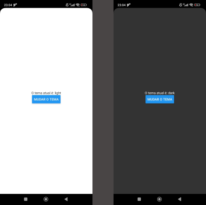

# Aula 04: Implementando um Tema Escuro/Claro com Context API

Neste exercício, foi proposto a implementação de um sistema de **tema claro e escuro** utilizando a **Context API** do **React Native**. O objetivo foi entender como gerenciar e utilizar o estado global em uma aplicação React Native, permitindo que os usuários alternem entre os modos de tema.

## Objetivo

O objetivo deste exercício é criar um toggle para alternar entre os temas claro e escuro usando a **Context API** no React Native. Com isso, é possível aplicar um tema dinâmico e global em toda a aplicação, permitindo que o usuário altere as preferências de exibição.

## Passo a Passo

### 1. Criar o Contexto de Tema
- Crie um arquivo chamado `ThemeContext.js` para definir o contexto de tema.
- Neste arquivo, defina o estado para armazenar o tema atual e uma função para alternar entre os temas (claro e escuro).

### 2. Integrar o `ThemeProvider` no App
- No arquivo `App.js`, envolva o componente principal com o `ThemeProvider` que será responsável por fornecer o estado de tema para todos os componentes descendentes.
- Isso permitirá que qualquer componente tenha acesso ao tema atual e possa alterná-lo.

### 3. Usar o Contexto para Aplicar o Tema
- Em qualquer componente que deseje utilizar o tema (como backgrounds, texto, etc.), use o `useContext` para acessar o `theme` e a função `toggleTheme`.
- A partir desse acesso, altere a aparência do componente conforme o tema selecionado (exemplo: cores de fundo, texto, ícones, etc.).

### Resultados
